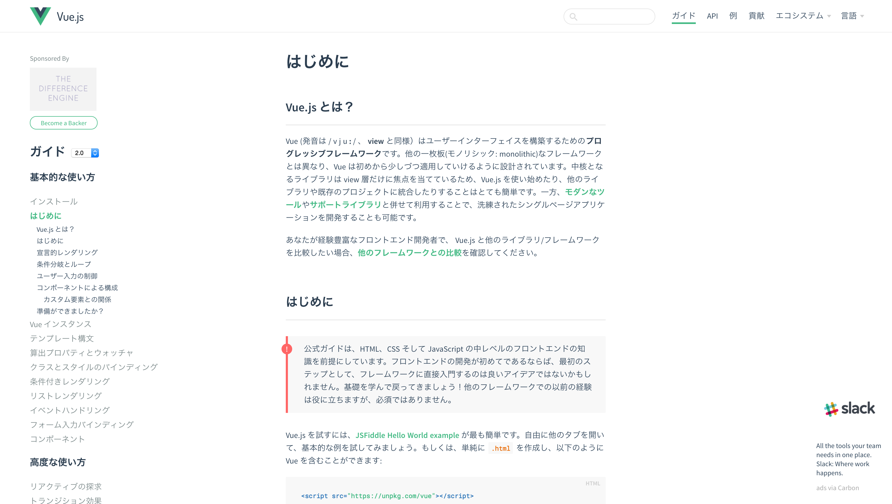

% Rails 5.1でVue.js触ってみた
% yamotonalds
% 2017-03-13

# Rails 5.1でVue.js触ってみた


## もくじ

- Vue.jsって何？
- Rails 5.1でVue.jsを使えるようにする
- Ajaxで取ってきたデータを表示してみる
- loader（？）を変えてみる

# Vue.jsって何？

## 


- jsフレームワーク（View周り）
- Reactっぽい感じ？
- 双方向bindingとかVirtual DOMとか
- コンポーネント指向
- 速いらしい

## 公式サイトが日本語



## 


# Rails 5.1でVue.jsを使えるようにする

## Install

. . . 


[http://qiita.com/jnchito/items/30ab14ebf29b945559f6](http://qiita.com/jnchito/items/30ab14ebf29b945559f6)

## 

```
rails new --webpack=vue application_name
brew install yarn
rails webpacker:install
rails webpacker:install:vue
webpack
```

. . . 

かんたん！

. . .

`webpack` 実行時のエラーも無かった。

## 

（空コントローラーを作って生成されたhello_vueを表示するようにすると）


## ソースコード


<figcaption>app.vue</figcaption>

## 開発サポート用のChrome拡張もあります


# Ajaxで取ってきたデータを表示してみる

## Vue.jsは特に通信の仕組みを持ってない

少し前までは `vue-resource` というAjaxライブラリがあった。


## 先日引退した


## 

Railsで言うところのgemに切り出された状態。

まだ使える。


ただ、公式推奨は `axios` というライブラリになった。

## axiosを使ってみる


<figcaption>app.vue</figcaption>

## 適当にコントローラーを用意する


## できた


# loader（？）を変えてみる

## もう一度ソースコードをご覧ください


<figcaption>app.vue</figcaption>

## 🐼思った

ES 2015とか使えるjsは良いとして

HTMLとかCSSとか素で書くのつらくない？ 

## 🐼探した


<figcaption>vue-loaderのreadme</figcaption>

## 

`config/webpack/shared.js` を見たらSCSSは既に使えそうだったので jade を探した。

## 犬になってた🐶


## package.jsonに🐶を追加


## 🐼すっきりした


<figcaption>app.vue</figcaption>


# 感想

## Railsでのinstallについて

- RailsでVue.js使い始めるまでが楽
    - 楽すぎて全然理解してない
    - SPAにするならRailsをAPIモードにして切り離しちゃって良いのでは？

## Vue.jsについて

- 書くこと少なくて楽
    - 複雑なアプリケーションになったら？
- 公式サイト日本語なのは助かる
- コンポーネント指向はやりやすそう
- `.vue` ファイルは賛否両論ありそう
